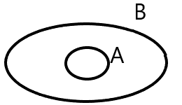

<!-- @import "[TOC]" {cmd="toc" depthFrom=1 depthTo=6 orderedList=false} -->

<!-- code_chunk_output -->

- [Analisi Matematica 2024 - 2025](#analisi-matematica-2024---2025)
  - [Insiemistica](#insiemistica)
    - [Modi per rappresentare gli insiemi](#modi-per-rappresentare-gli-insiemi)
    - [Inclusione](#inclusione)
    - [Differenza tra insiemi](#differenza-tra-insiemi)
    - [Unione tra insiemi](#unione-tra-insiemi)
    - [Intersezione tra insiemi](#intersezione-tra-insiemi)
    - [Prodotto cartesiano](#prodotto-cartesiano)
  - [Logica](#logica)
    - [Proposizione](#proposizione)
      - [Implicazione](#implicazione)
    - [Equivalenza tra proposizioni](#equivalenza-tra-proposizioni)
  - [Insiemi Numerici](#insiemi-numerici)
    - [Insiemi separati](#insiemi-separati)
  - [Funzioni](#funzioni)
    - [Funzione composta](#funzione-composta)

<!-- /code_chunk_output -->

# Analisi Matematica 2024 - 2025
## Insiemistica
Gli insiemi si indicano con la lettera maiuscola (es: A, B, X, $\dots$).
Negli insiemi ci sono degli elementi, indicati con lettere minuscole (a, b, x, $\dots$).
Un elemento appartiene a un insieme (a \in A).

### Modi per rappresentare gli insiemi
|modo|rappresentazione|
|---|---|
|elencazione|$A=\{0,1,3\}$|
|caratteristica|$ B=\{4,5,6\}=\{ n\in \mathbb{N} \vert 4 \leq n \leq 6 \} $|
|diagrammi di eulero-venn||

### Inclusione
Dati due insiemi $A, B$ si dice che l'insieme $A$ è INCLUSO nell'insieme $B$, e si indica con il simbolo $A \subseteq B$, se tutti gli elementi dell'insieme $A$ sono elementi dell'insieme $B$.
$A=\{4, 5, 6\}$; $B=\{n \in \mathbb{N} \vert n \geq 4\}$; $A \subseteq B$
se l'insieme $B$ contiene anche elementi che NON appartengono all'insieme $A$ si indica con $A \varsubsetneqq B$

### Differenza tra insiemi
L'insieme differenza contiene tutti gli elementi di A che non appartengono all'insieme B, in simboli:
$A \backslash B=\{a \in A \vert a \notin B\}$
esempio: $A= \{4,5,6\}; B=\{n \in mathbb{N} \vert n \geq 4\}; A \backslash B = \emptyset$[^1]
esempio 2: $B \backslash A=\{n \in \mathbb{N} \vert n \geq 7\}$
con eulero venn:

### Unione tra insiemi
$A \cup B = \{x \in A \vee c \in B\}$[^2]
esempio: $A=\{1,2,3\}; B=\{n \in \mathbb{N} \vert n \geq 2\}; A \cup B = \{n \in \mathbb{N} \vert n \geq 1\}$

### Intersezione tra insiemi
$A \cap B =\{x \in A \wedge c \in B\}$
esempio con Eulero Venn:

### Prodotto cartesiano
Dati 2 insiemi $A, B$ si chiama **prodotto cartesiano** tra l'insieme $A$ e $B$ e si indica con il simbolo $A \times B$ l'insieme di tutte le coppie ordinate $(a, b)$ in modo tale che $a \in A, b \in B$
$A \times B = \{ (a, b) \vert a \in A \wedge b \in B\}$

esempio: $A=\{1, 2, 3\}; B=\{4, 5\};$
$A \times B=\{ (1,2), (1,5), (2,4), (2,5), (3,4), (3,5) \}$
$b \times A=\{ (4,1), (4,2), (4,3), (5,1), (5,2), (5,3) \}$
solitamente $A \times B \neq B \times A$

## Logica
### Proposizione
<ins>Definizione</ins> una **proposizione** è una affermazione di cui si può dire se è VERA o FALSA.
#### Implicazione
$p \Rightarrow q$
Il fatto che la proposizione $p$ sia **vera** implica che anche la proposizione $q$ è **vera**. Se, invece, $p$ è **falsa** non posso dire <ins>nulla</ins> su $q$.
NB: Se $q$ è **vera** non posso dire nulla su $p$.
**Contronominale** Se $q$ è **falsa** allora $p$ è **falsa**.

### Equivalenza tra proposizioni
Nel caso in cui contemporaneamente $p \Rightarrow q$ e $q \Rightarrow p$ diciamo che $p$ e $q$ sono **equivalenti** e scriviamo $p \Leftrightarrow q$ (se e solo se)
$p$ è **vera** se e solo se $q$ è **vera**

## Insiemi Numerici
|Simbolo|Nome insieme|elementi|
|:---:|:---:|:---|
|$\mathbb{N}$|numeri naturali|$\{ 0,1,2,\dots \}$|
|$\mathbb{Z}$|numeri interi|$\{\dots, -2, -1, 0, 1, 2, \dots\}$|
|$\mathbb{Q}$|numeri razionali|$\{ \frac{m}{n} \vert m, n \in \mathbb{Z}, n \neq 0 \}$|
|$\mathbb{R}$|numeri reali|si possono rappresentare graficamente con una retta|

Non posso coprire tutti i punti di una retta con i numeri razionali
**Teorema** se $q^2=2 \Rightarrow q \notin \mathbb{Q}$

La **contronominale** $q \in \mathbb{Q} \Rightarrow q^2 \neq 2$
Dimostriamo per assurdo
<ins>Dimostrazione</ins>: supponiamo per assurdo che esiste almeno un $q \in \mathbb{Q}$ tale che $q^2=2$. Sia $q$ della forma $\frac{n}{m}$ con $n, m \in \mathbb{Z}$ supponiamo per assurdo che esiste almeno un $q=\frac{n}{m},n,m \in \mathbb{Z},m \neq 0$ posso supporre che $q$ sia ridotta ai minimi termini.
Dall'ipotesi assurda so che $q = \frac{n}{m} q^2=\frac{n^2}{m^2}$
$\frac{n^2}{m^2}=2 \Longleftrightarrow n^2=2m^2 \Rightarrow n^2$ deve essere pari $\Rightarrow n$ è pari
se $n$ è pari, $n$ è della forma $n=2p, p \in \mathbb{Z}$
Quindi $n^2=2m^2 \leftrightarrow 4p^2=2m^2 \Leftrightarrow m^2=2p^2$
quindi $m^2$ è pari, pertanto m è pari, ma questo è *assurdo* perché $\frac{n}{m}$ era ridotta ai minimi termini
($m$, $n$ entrambi pari $\rightarrow$ posso semplificare almeno con 2)

### Insiemi separati
<ins>Definizione</ins> siano $a$, $b$ due sottoinsiemi dell'insieme dei numeri reali, diciamo che gli insiemi $A$, $B$ sono separati se $\forall a \in $A$, b \in B$ si ha $a \leq b$.
Alcuni esempi
- 1) $B = \{ x \in \mathbb{R} \vert x>0\}; A=\{x \in \mathbb{R} \vert x \leq 0\}$
- 2) $A= \{x \in \mathbb{R} \vert x \leq -2\}; B=\{x \in \mathbb{R} \vert x \geq 0\}$

L'insieme $\mathbb{R}$ soddisfa l'**assioma di completezza**; $\mathbb{R}$ è completo cioè $\forall A, B \subseteq \mathbb{R}$ separati $\exists c$ tale che $a \leq c \leq b, \forall a \in A, \forall b \in B$. Ovvero $c$ viene detto elemento di separazione.

nel 1° es: 0 è l'unico elemento di separazione
nel 2° es: qualunque numero reale $\geq -2$ e $\le 0$ è elemento di separazione.

## Funzioni
<ins>Definizione </ins> siano $A, B$ insiemi non vuoti, si chiama funzione di $A$ in $B$, scritto $f: A \rightarrow B, a \mapsto f(a)$, ogni "legge" che associa ad ogni elemento $a \in A$ almeno un elemento $b \in B$

<ins>Definizione</ins> Data $f: A \rightarrow B$ poniamo $f(A):=\{f(a) \vert a \in A\}$. Si pone inoltre $graph(f):={a, f(a) \vert a \in A}$ (grafico di f)

Osservazione $f(A) \subseteq B$ NB: possono non coincidere
coincidere $graph(f) \subseteq A \times B$

Esempio:
$f: \mathbb{R} \leftarrow \mathbb{R}$
$x \leftarrow f(x) = e^x$
$f(\mathbb{R}) = \{e^x \vert x \in \mathbb{R}\} = ]0, +\infty[ = \{y \in \mathbb{R} \vert 0 <y< +\infty\}$
(in questo esempio Codominio $\neq$ Insieme delle immagini)

<ins>Definizione</ins> Sia $f: A \rightarrow B$ funzione. Essa si dice:
- Iniettiva se $\forall a_1, a_2 \in A$ con $a_1 \neq a_2$ si ha $f(a_1) \neq f(a_2)$
- Suriettiva se $f(A) = f(B)$ (ossia $\forall b \in B \exists a \in A$ tale che $b = f(a)$)
- Biettiva se è sia iniettiva che suriettiva

Osservazione: abbiamo definito f **iniettiva** se e solo se $\forall a_1, a_2 \in A$ con $a_1 \neq a_2$ si ha $f(a_1) \neq f(a_2)$
usando la logica $p \Rightarrow q$ possiamo scrivere la
**contronominale** $\forall a_1, a_2 \in A, f(a_1) = f(a_2) \Rightarrow a_1 = a_2$

### Funzione composta
<ins>Definizione</ins> Siano $f: A \rightarrow B$ e $g: C \rightarrow D$ due funzioni. Allora è benposta un'altra funzione denotata $g \circ f$ (si legge g composto f o composizione di f e g)
$g \circ f:$ |$A \rightarrow D$
$a \mapsto (g \circ f)(a):= g(f(a))$

<!-- Footnotes -->
[^1]:$\emptyset=$ insieme vuoto
[^2]: $\vee=$ vel / OR / oppure