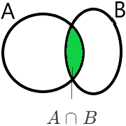

<!-- @import "[TOC]" {cmd="toc" depthFrom=1 depthTo=6 orderedList=false} -->

<!-- code_chunk_output -->

- [Analisi Matematica 2024 - 2025](#analisi-matematica-2024---2025)
  - [Insiemistica](#insiemistica)
    - [Modi per rappresentare gli insiemi](#modi-per-rappresentare-gli-insiemi)
    - [Inclusione](#inclusione)
    - [Differenza tra insiemi](#differenza-tra-insiemi)
    - [Unione tra insiemi](#unione-tra-insiemi)
    - [Intersezione tra insiemi](#intersezione-tra-insiemi)
    - [Prodotto cartesiano](#prodotto-cartesiano)
  - [Logica](#logica)
    - [Proposizione](#proposizione)
      - [Implicazione](#implicazione)
    - [Equivalenza tra proposizioni](#equivalenza-tra-proposizioni)
  - [Insiemi Numerici](#insiemi-numerici)
    - [Insiemi separati](#insiemi-separati)
  - [Funzioni](#funzioni)
    - [Funzione composta](#funzione-composta)
    - [Funzione inversa](#funzione-inversa)
  - [Limiti superiori e inferiori](#limiti-superiori-e-inferiori)
    - [Teorema dell'estremo superiore](#teorema-dellestremo-superiore)
    - [Esempi di monotonia](#esempi-di-monotonia)
      - [Funzione strettamente crescente](#funzione-strettamente-crescente)
      - [Funzione crescente](#funzione-crescente)

<!-- /code_chunk_output -->

# Analisi Matematica 2024 - 2025
## Insiemistica
Gli insiemi si indicano con la lettera maiuscola (es: A, B, X, $\dots$).
Negli insiemi ci sono degli elementi, indicati con lettere minuscole (a, b, x, $\dots$).
Un elemento appartiene a un insieme (a \in A).

### Modi per rappresentare gli insiemi
|modo|rappresentazione|
|---|---|
|elencazione|$A=\{0,1,3\}$|
|caratteristica|$ B=\{4,5,6\}=\{ n\in \mathbb{N} \vert 4 \leq n \leq 6 \} $|
|diagrammi di eulero-venn||

### Inclusione
Dati due insiemi $A, B$ si dice che l'insieme $A$ è INCLUSO nell'insieme $B$, e si indica con il simbolo $A \subseteq B$, se tutti gli elementi dell'insieme $A$ sono elementi dell'insieme $B$.
$A=\{4, 5, 6\}$; $B=\{n \in \mathbb{N} \vert n \geq 4\}$; $A \subseteq B$
se l'insieme $B$ contiene anche elementi che NON appartengono all'insieme $A$ si indica con $A \varsubsetneqq B$

### Differenza tra insiemi
L'insieme differenza contiene tutti gli elementi di A che non appartengono all'insieme B, in simboli:
$A \backslash B=\{a \in A \vert a \notin B\}$
esempio: $A= \{4,5,6\}; B=\{n \in mathbb{N} \vert n \geq 4\}; A \backslash B = \emptyset$[^1]
esempio 2: $B \backslash A=\{n \in \mathbb{N} \vert n \geq 7\}$
con eulero venn:

### Unione tra insiemi
$A \cup B = \{x \in A \vee c \in B\}$[^2]
esempio: $A=\{1,2,3\}; B=\{n \in \mathbb{N} \vert n \geq 2\}; A \cup B = \{n \in \mathbb{N} \vert n \geq 1\}$

### Intersezione tra insiemi
$A \cap B =\{x \in A \wedge c \in B\}$
esempio con Eulero Venn:

### Prodotto cartesiano
Dati 2 insiemi $A, B$ si chiama **prodotto cartesiano** tra l'insieme $A$ e $B$ e si indica con il simbolo $A \times B$ l'insieme di tutte le coppie ordinate $(a, b)$ in modo tale che $a \in A, b \in B$
$A \times B = \{ (a, b) \vert a \in A \wedge b \in B\}$

esempio: $A=\{1, 2, 3\}; B=\{4, 5\};$
$A \times B=\{ (1,2), (1,5), (2,4), (2,5), (3,4), (3,5) \}$
$b \times A=\{ (4,1), (4,2), (4,3), (5,1), (5,2), (5,3) \}$
solitamente $A \times B \neq B \times A$

## Logica
### Proposizione
<ins>Definizione</ins> una **proposizione** è una affermazione di cui si può dire se è VERA o FALSA.
#### Implicazione
$p \Rightarrow q$
Il fatto che la proposizione $p$ sia **vera** implica che anche la proposizione $q$ è **vera**. Se, invece, $p$ è **falsa** non posso dire <ins>nulla</ins> su $q$.
NB: Se $q$ è **vera** non posso dire nulla su $p$.
**Contronominale** Se $q$ è **falsa** allora $p$ è **falsa**.

### Equivalenza tra proposizioni
Nel caso in cui contemporaneamente $p \Rightarrow q$ e $q \Rightarrow p$ diciamo che $p$ e $q$ sono **equivalenti** e scriviamo $p \Leftrightarrow q$ (se e solo se)
$p$ è **vera** se e solo se $q$ è **vera**

## Insiemi Numerici
|Simbolo|Nome insieme|elementi|
|:---:|:---:|:---|
|$\mathbb{N}$|numeri naturali|$\{ 0,1,2,\dots \}$|
|$\mathbb{Z}$|numeri interi|$\{\dots, -2, -1, 0, 1, 2, \dots\}$|
|$\mathbb{Q}$|numeri razionali|$\{ \frac{m}{n} \vert m, n \in \mathbb{Z}, n \neq 0 \}$|
|$\mathbb{R}$|numeri reali|si possono rappresentare graficamente con una retta|

Non posso coprire tutti i punti di una retta con i numeri razionali
**Teorema** se $q^2=2 \Rightarrow q \notin \mathbb{Q}$

La **contronominale** $q \in \mathbb{Q} \Rightarrow q^2 \neq 2$
Dimostriamo per assurdo
<ins>Dimostrazione</ins>: supponiamo per assurdo che esiste almeno un $q \in \mathbb{Q}$ tale che $q^2=2$. Sia $q$ della forma $\frac{n}{m}$ con $n, m \in \mathbb{Z}$ supponiamo per assurdo che esiste almeno un $q=\frac{n}{m},n,m \in \mathbb{Z},m \neq 0$ posso supporre che $q$ sia ridotta ai minimi termini.
Dall'ipotesi assurda so che $q = \frac{n}{m} q^2=\frac{n^2}{m^2}$
$\frac{n^2}{m^2}=2 \Longleftrightarrow n^2=2m^2 \Rightarrow n^2$ deve essere pari $\Rightarrow n$ è pari
se $n$ è pari, $n$ è della forma $n=2p, p \in \mathbb{Z}$
Quindi $n^2=2m^2 \leftrightarrow 4p^2=2m^2 \Leftrightarrow m^2=2p^2$
quindi $m^2$ è pari, pertanto m è pari, ma questo è *assurdo* perché $\frac{n}{m}$ era ridotta ai minimi termini
($m$, $n$ entrambi pari $\rightarrow$ posso semplificare almeno con 2)

### Insiemi separati
<ins>Definizione</ins> siano $a$, $b$ due sottoinsiemi dell'insieme dei numeri reali, diciamo che gli insiemi $A$, $B$ sono separati se $\forall a \in $A$, b \in B$ si ha $a \leq b$.
Alcuni esempi
- 1) $B = \{ x \in \mathbb{R} \vert x>0\}; A=\{x \in \mathbb{R} \vert x \leq 0\}$
- 2) $A= \{x \in \mathbb{R} \vert x \leq -2\}; B=\{x \in \mathbb{R} \vert x \geq 0\}$

L'insieme $\mathbb{R}$ soddisfa l'**assioma di completezza**; $\mathbb{R}$ è completo cioè $\forall A, B \subseteq \mathbb{R}$ separati $\exists c$ tale che $a \leq c \leq b, \forall a \in A, \forall b \in B$. Ovvero $c$ viene detto elemento di separazione.

nel 1° es: 0 è l'unico elemento di separazione
nel 2° es: qualunque numero reale $\geq -2$ e $\le 0$ è elemento di separazione.

## Funzioni
<ins>Definizione </ins> siano $A, B$ insiemi non vuoti, si chiama funzione di $A$ in $B$, scritto $f: A \rightarrow B, a \mapsto f(a)$, ogni "legge" che associa ad ogni elemento $a \in A$ almeno un elemento $b \in B$

<ins>Definizione</ins> Data $f: A \rightarrow B$ poniamo $f(A):=\{f(a) \vert a \in A\}$. Si pone inoltre $graph(f):={a, f(a) \vert a \in A}$ (grafico di f)

Osservazione $f(A) \subseteq B$ NB: possono non coincidere
coincidere $graph(f) \subseteq A \times B$

Esempio:
$f: \mathbb{R} \leftarrow \mathbb{R}$
$x \leftarrow f(x) = e^x$
$f(\mathbb{R}) = \{e^x \vert x \in \mathbb{R}\} = ]0, +\infty[ = \{y \in \mathbb{R} \vert 0 <y< +\infty\}$
(in questo esempio Codominio $\neq$ Insieme delle immagini)

<ins>Definizione</ins> Sia $f: A \rightarrow B$ funzione. Essa si dice:
- Iniettiva se $\forall a_1, a_2 \in A$ con $a_1 \neq a_2$ si ha $f(a_1) \neq f(a_2)$
- Suriettiva se $f(A) = f(B)$ (ossia $\forall b \in B \exists a \in A$ tale che $b = f(a)$)
- Biettiva se è sia iniettiva che suriettiva

Osservazione: abbiamo definito f **iniettiva** se e solo se $\forall a_1, a_2 \in A$ con $a_1 \neq a_2$ si ha $f(a_1) \neq f(a_2)$
usando la logica $p \Rightarrow q$ possiamo scrivere la
**contronominale** $\forall a_1, a_2 \in A, f(a_1) = f(a_2) \Rightarrow a_1 = a_2$

### Funzione composta
<ins>Definizione</ins> Siano $f: A \rightarrow B$ e $g: C \rightarrow D$ due funzioni. Allora è benposta un'altra funzione denotata $g \circ f$ (si legge g composto f o composizione di f e g)
|$g \circ f:$|
|:---|
|$A \rightarrow D$|
|$a \mapsto (g \circ f)(a):= g(f(a))$|

 Attenzione: $g \circ f \neq f \circ g$

### Funzione inversa
<ins>Definizione</ins> Sia $f: A \rightarrow B$ funzione. Essa si dice invertibile se esiste $g: B \rightarrow A$ tale che valgono contemporaneamente le seguenti due condizioni:
1. $g(f(a))=a, \forall a \in A$
2. $f(g(b))=b, \forall b \in B$
In tal caso si può provare che tale g è unica ed essa si chiama la [^3] **funzione inversa** di $f$ e si denota con $f^{-1}$

**Teorema:** Una funzione è invertibile se e solo se è biettiva
Osservazione: se $f$ è biunivoca allora $\forall b \in B \exists! a \in A$ tale che $b=f(a)$

Consideriamo la funzione $f: \mathbb{R} \rightarrow \mathbb{R}$
$x \mapsto f(x)=x^2$

Questa funzione non è invertibile perché non è ne iniettiva ne suriettiva
Non è iniettiva perché $f(-1)=f(1)$ (due elementi distinti di $A$ hanno la stessa immagine)
Non è suriettiva perché una qualsiasi $f(x)=k$ con $ k< 0 $ non interseca il grafico di $f$

NB: possiamo però modificare $f$ affinché diventi biunivoca e quindi invertibile
Se restringiamo il codominio di $f$ la rendiamo suriettiva
Se tagliamo il dominio di $f$ la rendiamo iniettiva

Con la funzione dell'esempio precedente
$F: \mathbb{R} \rightarrow f(\mathbb{R})=[0, +\infty[$
$x \mapsto F(x)=x^2$
ora $F$ è suriettiva ma comunque non iniettiva.

Se restringiamo il dominio di $F$ (quindi lo "tagliamo") otteniamo ad esempio
$\varphi(x)=x^2$
$\varphi: [0, +\infty[ \rightarrow [0, +\infty[$

$\varphi$ è quindi iniettiva e suriettiva, quindi biunivoca

Dato che è biunivoca, per il teorema di cui sopra possiamo affermare che è **invertibile**.
Troviamo la funzione $\varphi^{-1}$
Dato $b \in [0, +\infty[ \exists! a \in [0, +\infty[$ tale che $b=\varphi(a)$ ossia $b=a^2$[^4]

 non confondere $\sqrt{r}$ con le soluzioni dell'equazione $x^2=r$
$x^2=9 \Leftrightarrow x=\sqrt{9}$ ma $ \sqrt{9} \neq \pm 3$

## Limiti superiori e inferiori
<ins>Definizione</ins> Sia $A \subseteq \mathbb{R}$ non vuoto. Si dice:
1. limitato superiormente se $\exists b \in \mathbb{R}$ tale che si ha $a \leq b$ ogni siffatto b si chiama un **maggiorante** per $A$
2. limitato inferiormente se $\exists b \in \mathbb{R}$ tale che si ha $b \leq a$ ogni siffatto b si chiama un **minorante** per $B$
3. limitato se è limitato sia superiormente che inferiormente
4. illimitato se **non** è limitato
4.1 illimitato superiormente se non è limitato superiormente
4.2 illimitato inferiormente se non è limitato inferiormente

Esempi:
- $\mathbb{N}=\{0, 1, 2, 3, 4, \dots\}
  - Limitato inferiormente $\rightarrow$ 0 è minorante
  - Illimitato superiormente

- $A=]0, 1[ = \{x \in \mathbb{R} \vert 0 < x < 1\}$
  - Limitato superiormente $\rightarrow$ qualsiasi numero $\geq 1$ è maggiorante
  - Limitato inferiormente $\rightarrow$ qualsiasi numero $\leq 0$ è minorante

<ins>Definizione</ins> Sia $A \subseteq \mathbb{R}, A \neq \emptyset$
- un numero $M \in \mathbb{R}$ si dice **massimo** di $A$ se verifica:
  - $a \leq M, \forall a \in A$ (M è un maggiorante)
  - $M \in A$ (M appartiene ad A)
- un numero $m \in \mathbb{R}$ si dice **minimo** di $A$ se verifica:
  - $a \geq m, \forall a \in A$ (m è un minorante)
  - $m \in A$ (m appartiene ad A)

Si può dimostrare che, <ins>se esiste</ins>, il massimo è unico; allora si può dire che è IL massimo di A e si denota con $\max A$
Analogamente per il minimo si può dire che è unico e si denota con $\min A$

Esempi:
- $A=[-5, \pi[$
  - ha minimo -5
  - non ha massimo
- $A=[0,1[$
  - ha minimo 0
  - non ha massimo

Se $A \subseteq \mathbb{N}, A \neq \emptyset$ allora $A$ ha sempre un minimo[^5]

### Teorema dell'estremo superiore
Sia $A \subseteq \mathbb{R}, A \neq \emptyset$ con $A$ limitato superiormente. Allora esiste il minimo dei maggioranti di $A$ e si denota con $\sup A$ (detto **estremo superiore** di $A$)

Analogamente se $A$ è limitato inferiormente allora esiste il massimo dei minoranti di $A$ e si denota con $\inf A$ (detto **estremo inferiore** di $A$)

<ins>Dimostrazione</ins>: Sia $A \neq \emptyset$, limitato superiormente e consideriamo
$B:=\{b \in \mathbb{R} \vert b \text{ è un maggiorante di } A\}$
Si noti che $B \neq \emptyset$ perché $A$ è limitato superiormente

È banale riconoscere che $A$ e $B$ sono insiemi separati ossia $\forall a \in A, b \in B$ si ha $a \leq b$[^6]
Per l'assioma di completezza di \mathbb{R}, $\exists$ almeno un elemento di separazione $c \in \mathbb{R}$ ossia $\forall a \in A, \forall b \in B$ vale $a \leq c \leq b$.
Dalla informazione $a \leq c, \forall a \in A$ segue che $c$ è un maggiorante di $A$ ossia $c \in B$.
Dall'altra parte $c \leq b, \forall b \in B$ segue che $c$ è minorante di $B$.
Riassumendo:
- $c \in B$
- $c \leq b, \forall b \in B$
ossia $c$ è il minimo di $B$

Esempio:
$A=[0,1[$
$B=\{b \in \mathbb{R} \vert b \text{ è un maggiorante di } A\} = [1, +\infty[$
quindi il $\min B = 1 \Rightarrow \sup [0,1[=1$[^7]

<ins>Definizione</ins> Sia $A \neq \emptyset$, $A$ illimitato superiormente (ma allora non vale il **teorema**) per convenzione si pone $\sup A = +\infty$
Analogamente se $A \neq \emptyset$, $A$ è illimitato inferiormente si pone $\inf A = -\infty$

<ins>Osservazione</ins> $\forall A \neq \emptyset, A \subseteq \mathbb{R}; \exists \sup A, \inf A \in \mathbb{R} \cup \{ +\infty , -\infty\}$

Esempio:
$A=\{frac{1}{n} \vert n \in \mathbb{N} \backslash \{0\} \}$
Verificare che $0$ è $\inf A$ benché $A$ **non** sia dotato di minimo

<ins>Definizione</ins> Sia $f:A \rightarrow \mathbb{R}$ funzione (con $A$ insieme qualunque).
- Se esistono, si pone $\max_A f:=\max f(A)$[^8]
- Analogamente $\min_A f:=\min f(A)$[^9]
- Esiste certamente $\sup_A f:=\sup f(A)$
- Analogamente $\inf_A f:=\inf f(A)$

<!-- Lezione del 24/09/2024 -->
<!-- ! TODO: ricopia appunti -->

### Esempi di monotonia
NB: il dominio naturale di una funzione è diverso dal dominio della funzione stessa; può essere che sia stata limitata

#### Funzione strettamente crescente
|f(x)|graph|
|---|---|
|$f(x)=x^2 \vert [0, +\infty[$[^10]   se è **strettamente crescente** ($<$)   allora deve per forza essere **crescente** ($\leq$)[^11]||

#### Funzione crescente
|f(x)|graph|
|---|---|
|prendendo due valori $x_1$, $x_2$   possiamo notare che in un tratto della funzione si verifica che   $f(x_1)=f(x_2)$||

### Funzione monotona
|$f(x)$|graph|
|---|---|
|$f(x)=1$ non può essere considerata costante   è sia crescente che decrescente|img|

### Funzione con asintoto in 0
|$f(x)$|graph|
|---|---|
|$f:\mathbb{R} \backslash \{0\} \rightarrow \mathbb{R}$   $f(x)=frac{1}{x}$   $f$ è **decrescente** se ristretta a $]-\infty, 0]$   $f$ è **decrescente** se ristretta a $[0, +\infty[$   non è decrescente su $\mathbb{R} \backslash \{0\}$|img|

### Parabola
|$f(x)$|graph|
|---|---|
|$f(x)=x^2$ su $\mathbb{R}$ non è nè **crescente** nè **decrescente**|img|

## Funzioni esponenziali
$y=a^x$ con $a>0$

<ins>Osservazione</ins> perché $a$ deve essere positivo
$-8=(-2)^3=(-2)^3*\frac{1}{2}*2=(-2)^2*\frac{1}{2}*3=\{[(-2)^2]^\frac{1}{2}\}^3={[4]^\frac{1}{2}}^3=\{\sqrt{4}\}^3={2}^3=8$ **impossibile**

$a=1 y=1^x=1 \rightarrow y=1$ non si ha più una funzione esponenziale
Quindi la funzione esponenziale per essere definita come tale deve avere la base tra $0$ e $1$ oppure maggiore di $1$

se $a>1$
$f:\mathbb{R} \rightarrow \mathbb{R} f(x)=a^x f(\mathbb{R})=\mathbb{R}^+ \backslash \{0\}$

|graph|proprietà|
|---|---|
|img|$a^x>0 \forall x \in \mathbb{R}$ $a^x$ è strettamente crescente all'aumentare di $a$ aumenta la rapidità del grafico passa per $(0,1)$|

se $0<a<1$
$f:\mathbb{R} \rightarrow \mathbb{R} f(\mathbb{R})=\mathbb{R}^+ \backslash \{0\}$

|graph|proprietà|
|---|---|
|img|$a^x \forall x \in \mathbb{R}$ $a^x$ è strettamente crescente al diminuire di $a$ aumenta la rapidità del grafico passa sempre per $(0,1)$|

## Logaritmi
### Cambiamento di base dei logaritmi
## La funzione logaritmica

<!-- Footnotes -->
[^1]:$\emptyset=$ insieme vuoto
[^2]: $\vee=$ vel / OR / oppure
[^3]: abbiamo scritto **la** funzione inversa perché è unica, è importante specificare gli articoli nelle definizioni
[^4]: notiamo che la equazione trovata è corrispondente alla equazione della radice quadrata $\varphi^{-1}(b)=\sqrt{b}$
[^5]: dimostrazione difficile, non la faremo
[^6]: per definizione di maggiorante
[^7]:  Non è il $\max A$
[^8]: $\max f(A)\{f(a) \vert a \in A\}
[^9]: $\min f(A)\{f(a) \vert a \in A\}
[^10]: in questo caso il dominio naturale di $f$ è $\mathbb{R}$ ma il dominio della funzione che abbiamo definito è $[o, +\infty[$
[^11]: essere strettamente crescente è un caso particolare della crescenza in senso lato. Analogamente per la decrescenza.