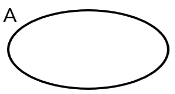

# Analisi Matematica 2024 - 2025
## Insiemistica
Gli insiemi si indicano con la lettera maiuscola (es: A, B, X, $\dots$).
Negli insiemi ci sono degli elementi, indicati con lettere minuscole (a, b, x, $\dots$).
Un elemento appartiene a un insieme (a \in A).

### Modi per rappresentare gli insiemi
|modo|rappresentazione|
|---|---|
|elencazione|$A=\{0,1,3\}$|
|caratteristica|$ B=\{4,5,6\}=\{ n\in \mathbb{N} \vert 4 \leq n \leq 6 \} $|
|diagrammi di eulero-venn||

### Inclusione
